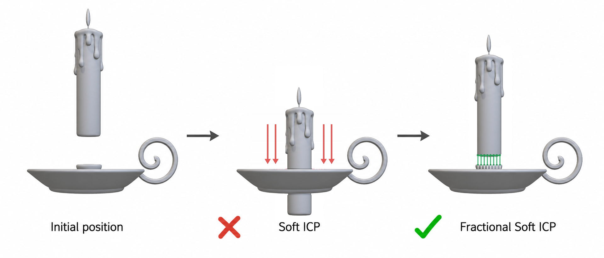

# Fractional Soft ICP

[](https://github.com/RotemGat/FractionalSoftICP/actions/workflows/tests.yml)
[](LICENSE)
[](pyproject.toml)

A lightweight PyTorch loss for differentiable partial alignment of 3D point
clouds.

Fractional Soft ICP focuses the alignment objective on the closest fraction of
the moving point cloud. It is useful when only part of one object should make
contact with another, while standard ICP or full-cloud Chamfer objectives may
pull unrelated regions together.

The loss was introduced as a geometric attachment objective in the CVPR 2026
paper
[Copy-Transform-Paste: Zero-Shot Object-Object Alignment Guided by Vision-Language and Geometric Constraints](https://openaccess.thecvf.com/content/CVPR2026/html/Gatenyo_Copy-Transform-Paste_Zero-Shot_Object-Object_Alignment_Guided_by_Vision-Language_and_Geometric_Constraints_CVPR_2026_paper.html).

## Why Fractional?

<p align="center">
  
</p>

Standard Soft ICP forms correspondences using the entire source object. When
only a small region should touch the target, those global correspondences can
pull the object into an incorrect placement. Fractional Soft ICP first keeps
only the closest fraction of source points, then applies the soft
correspondence objective to that contact-focused subset.

## Installation

Install directly from GitHub:

```bash
pip install git+https://github.com/RotemGat/FractionalSoftICP.git
```

For local development:

```bash
git clone https://github.com/RotemGat/FractionalSoftICP.git
cd FractionalSoftICP
pip install -e ".[test]"
```

## Quick Start

```python
import torch
from fractional_soft_icp import fractional_soft_icp_loss

# source: moving points, target: fixed points
source = torch.randn(2048, 3, device="cuda", requires_grad=True)
target = torch.randn(4096, 3, device="cuda")

loss = fractional_soft_icp_loss(
    source,
    target,
    fraction=0.25,
    sigma=0.1,
    chunk_size=1024,
)
loss.backward()
```

The function accepts either unbatched tensors shaped `(N, 3)` and `(M, 3)`, or
batched tensors shaped `(B, N, 3)` and `(B, M, 3)`.

You can also use the `torch.nn.Module` interface:

```python
from fractional_soft_icp import FractionalSoftICPLoss

criterion = FractionalSoftICPLoss(fraction=0.25, sigma=0.1)
loss = criterion(source, target)
```

## Inputs

| Argument | Meaning |
| --- | --- |
| `source` | Moving 3D points, shaped `(N, 3)` or `(B, N, 3)` |
| `target` | Fixed 3D points, shaped `(M, 3)` or `(B, M, 3)` |
| `fraction` | Closest fraction of source points to retain, in `(0, 1]` |
| `sigma` | Soft-correspondence bandwidth, in the same units as the points |
| `reduction` | Batch reduction: `"none"`, `"mean"`, or `"sum"` |
| `chunk_size` | Optional target chunk size for lower peak memory use |

`source` and `target` must use the same floating-point dtype and device. The
loss supports CPU, CUDA, autograd, and batched inputs.

## How It Works

1. Compute each source point's distance to its nearest target point.
2. Keep the closest `fraction` of source points.
3. Build soft correspondences from those points to all target points using a
   Gaussian kernel controlled by `sigma`.
4. Return the mean expected squared correspondence distance.

The subset selection is discrete, as in top-k and nearest-neighbor methods.
Gradients flow through the selected source points and their soft
correspondences.

## Choosing Parameters

- Start with `fraction=0.25` when the expected contact region is small.
- Increase `fraction` when a larger portion of the objects should align.
- Set `sigma` relative to your coordinate scale. Normalize point clouds first
  when possible.
- Use `chunk_size` for large point clouds. It lowers peak memory without
  changing the objective.

## Example

Run the included translation optimization:

```bash
python examples/optimize_translation.py
```

The example reports the learned translation and the decrease in loss. With
`fraction < 1`, the objective aligns the closest source subset; it is not
generally expected to recover a unique ground-truth translation for the full
point cloud.

## Citation

If you use Fractional Soft ICP, please cite:

```bibtex
@InProceedings{Gatenyo_2026_CVPR,
    author    = {Gatenyo, Rotem and Fried, Ohad},
    title     = {Copy-Transform-Paste: Zero-Shot Object-Object Alignment Guided by Vision-Language and Geometric Constraints},
    booktitle = {Proceedings of the IEEE/CVF Conference on Computer Vision and Pattern Recognition (CVPR)},
    month     = {June},
    year      = {2026},
    pages     = {14936-14945}
}
```

## License

MIT
